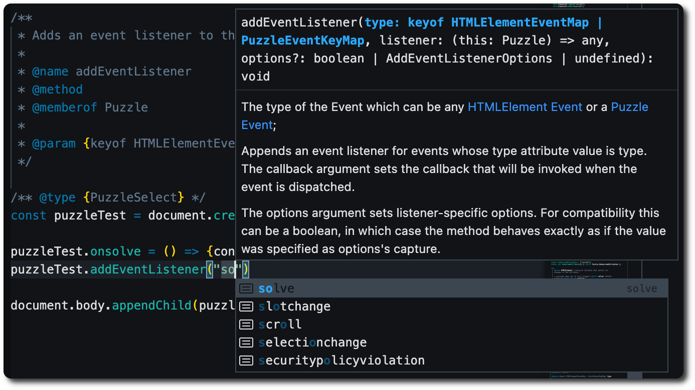

# Scape Room

This is a school project which consist of making a _Scape Room_ using web
techonlogies like:
- **HTML** to struct the page;
- **CSS** to style it;
- **JavaScript** as the programming language to use in order to make the
the interations in the page.

## Live play

The scape room can be played without having to download anything via the [github pages](https://filintodelgado.github.io/projecto1).

## Theme

The theme of our project is **Cinema** in the **90'** years. 

## Multimedia

It is also required to make a trailer presenting the game like in real life.

## API / Framework

In order to make this project we made a [api/framework](./api/) to
make puzzles, counters, forms and others requirements to the project.

There is also a documentation showing generated usign 
[JSDoc](https://jsdoc.app/). If you are usign a modern editor you will 
see useful information navigating the code.

## Admin account
> Email: admin@admin.com

> Password: 12345678

## Walkthrough

1. Signup or login usign the [admin account](#admin-account);
1. You will be redirected to the logged home page;
1. Click the play button to start the first room.